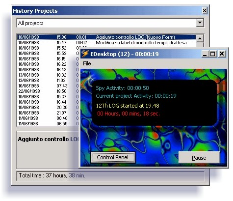



## SpyIDE \(VB IDE interceptor\)

### Description

SpyIDE runs on the try icon and detects any VB project that you are working on. When the project closes, SpyIDE will ask you a summary description about all changes made to the project and log the elapsed time and description. therefore, you will be able to check, at the end, the elapsed time needed to code a given project
 
### More Info
 

             |
---                |---
**Submitted On**   |2001-02-18 19:40:00
**By**             |[Fabio Guerrazzi](https://github.com/Planet-Source-Code/PSCIndex/blob/master/ByAuthor/fabio-guerrazzi.md)
**Level**          |Intermediate
**User Rating**    |4.7 (14 globes from 3 users)
**Compatibility**  |VB 4\.0 \(32\-bit\), VB 5\.0, VB 6\.0
**Category**       |[Complete Applications](https://github.com/Planet-Source-Code/PSCIndex/blob/master/ByCategory/complete-applications__1-27.md)
**World**          |[Visual Basic](https://github.com/Planet-Source-Code/PSCIndex/blob/master/ByWorld/visual-basic.md)
**Archive File**   |[CODE\_UPLOAD151562182001\.zip](https://github.com/Planet-Source-Code/fabio-guerrazzi-spyide-vb-ide-interceptor__1-21124/archive/master.zip)

